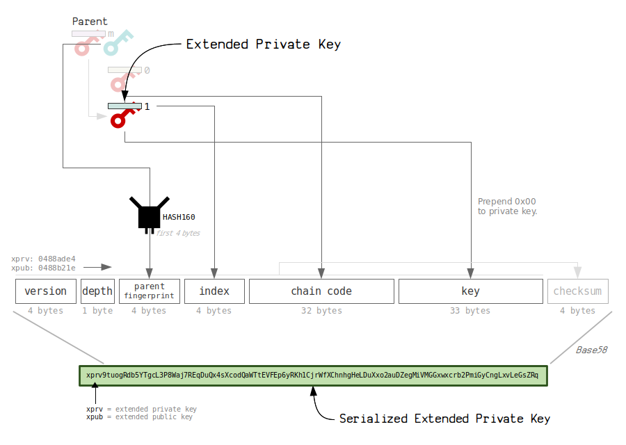

# btckeys

This repository implements a grpc server that provides btcoin address generation service, which
includes hd wallet generation and multisig wallet generation. RESTful HTTP API is also supported 
via grpc-gateway.

## HD Wallet Genration

Hierarchical Deterministic Wallet is a wallet that is derived from the parent public key or private key and 
you can take control. With specified path, you can infer the child public key and child private key but you
can't infer the parent private key vice versa. There are two kinds of derivation: hardened and non-hardened,
which can be specified by including "h" or "'" behind index in the path. For example: path "0/0" means two times of 
non-hardened derivation from parent key with index 0 for each time, while "0'/0" means a hardened derivation
at the first time and a non-hardened derivation at the second time.

The difference between hardened derivation and non-hardened derivation is that with the parent public key and 
the child private key, you can infer the parent private key and other child wallet keys for non-hardened derivation, 
while this is not possible for hardened derivation. But you can't generate a child wallet with the parent public key 
if there is a hardened index in the path, in other words hardened derivation is only allowed for private key.

As a server that serve the users to generate child hd wallets, to avoid the vulerable architecture that allows the 
users to upload private keys to the server, this server allows only derivation from parent public keys. (to check the
the vulnerability that allowing users to upload private keys to server has brought, refer to [this](https://www.blackhat.com/us-21/briefings/schedule/#how-i-used-a-json-deserialization-day-to-steal-your-money-on-the-blockchain-22815))

Actually, to generate child hd wallet address, you need an extended key rather than an ordinary key. which contains
more information besides the original key. 

If users want to generate a bech32 hd wallet address that conforms to BIP84, the user should first perform hardened 
derivation for the master xprv with path "m/84'/0'/0'" to get child xpub and then post child xpub and path like "0/0"
to server so that generate a BIP84 address.

## MultiSig Address Generation
For the compressed public keys, the m and n limit is 15-15, which changes to 7-7 when it comes to the uncompressed public
keys. Besides, with the same m and n value, compressed public keys make the redeem script shorter.

This server will ask for compressed public key strings to generate multisig address.
